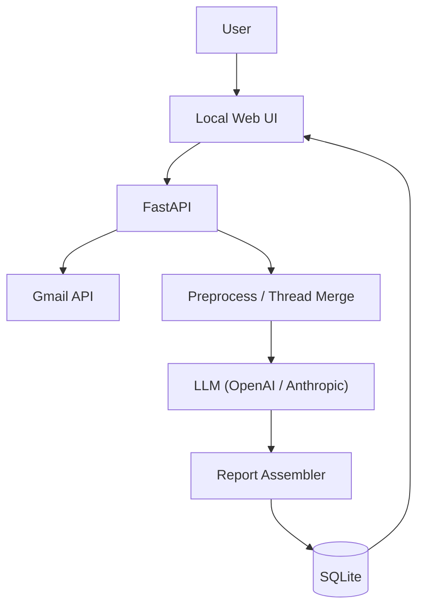

# Email Agent — Local Email Daily Digest

[English](README.md) | [简体中文](README.zh-CN.md)

A local app that fetches Gmail emails via OAuth (read-only) and uses AI (OpenAI or Anthropic) to generate a structured daily report, so you can stop constantly checking your inbox.

---

## Goals

- **Goal**: Pull recent Gmail emails (daily or on demand), identify what matters, and generate a “daily digest” you can view locally (highlights + to-dos + categorized summaries).
- **Non-goals (v1)**: Sending/replying automatically, multi-team permissions, mobile apps.

---

## MVP scope

- **Gmail OAuth login**: Local callback, requests `read-only` Gmail scope.
- **Email fetching**:
  - Default: last 24 hours (or a specified date).
  - Optional filters: unread, starred, sender, keywords.
- **Preprocessing**: deduplication, thread merge, plain-text extraction (subject/from/date/snippet).
- **AI summarization**:
  - Categories: Action Required / Important / Billing & Subscriptions / Social / Other.
  - Per email/thread: one-line summary + action required + suggested next step.
  - Daily report: 3–7 highlights + a to-do list.
- **Storage**: local SQLite with history queries.
- **Web UI**:
  - View a report by date.
  - Expand referenced email metadata (v1 can be snippet-only / link to Gmail).
  - Export: Markdown or HTML (at least one).
- **Security**: API keys live in `.env`; OAuth tokens are stored locally (not committed).

---

## Tech stack

| Area | Tech |
|------|------|
| Backend | FastAPI |
| Gmail | Google APIs (OAuth 2.0): `google-auth`, `google-auth-oauthlib`, `google-api-python-client` |
| AI | OpenAI API (`openai`) and/or Anthropic (`anthropic`) |
| Storage | SQLite + SQLAlchemy |
| Scheduling | MVP: manual + Windows Task Scheduler (optional APScheduler later) |
| UI | MVP: FastAPI + Jinja2 (can evolve to React/Vite later) |

---

## Architecture & data flow



### Module boundaries

- **FastAPI**: routes, auth middleware, request/response models
- **Gmail integration**: OAuth, fetching messages/threads, parsing headers/snippets
- **Preprocess**: dedupe, thread merge, plain text extraction, unified structures
- **LLM integration**: prompt building, API calls, structured output parsing
- **Storage**: persist reports + email references (no full bodies by default)
- **Web UI**: consumes APIs/templates only (does not directly access Gmail/LLM)

---

## Suggested project structure

```
app/
  main.py              # Entry point and route mounting
  web/                 # Jinja2 templates and static resources
  integrations/
    gmail/             # OAuth, fetching, parsing
    openai/            # prompts, API calls, retries
    anthropic/         # prompts, API calls, retries
  core/                # config, logging, time ranges, deduplication
  db/                  # models and persistence
  services/            # report generation pipeline
scripts/               # CLI scripts (generate reports, tests)
data/                  # local data (tokens, db, exports) - gitignored
```

---

## Configuration

### Environment variables (`.env`)

Copy `.env.example` to `.env` and fill in:

- `AI_PROVIDER`: `openai` or `claude`
- `OPENAI_API_KEY` / `OPENAI_MODEL`
- `ANTHROPIC_API_KEY` / `ANTHROPIC_MODEL`
- `APP_BASE_URL` (default: `http://127.0.0.1:8000`)

### Google OAuth (`credentials.json`)

1. Create an OAuth 2.0 client in [Google Cloud Console](https://console.cloud.google.com/)
2. Download the client file and place it as `credentials.json` in the project root
3. Set redirect URI to `http://127.0.0.1:8000/auth/google/callback`

Tip: `credentials.json.example` is a template. **Do not commit real credentials**.

---

## Getting started

1. **Install dependencies**

```bash
python -m venv .venv
.venv\Scripts\activate
pip install -r requirements.txt
```

2. **Start the FastAPI server**

```bash
uvicorn app.main:app --reload --host 127.0.0.1 --port 8000
```

3. **Authorize Gmail in your browser**

Open `http://127.0.0.1:8000` and follow the OAuth flow.

4. **Generate a report via CLI (optional)**

```bash
python scripts/generate_report.py
python scripts/generate_report.py --hours 24
python scripts/generate_report.py --date 2026-01-30
```

---

## Privacy & security

- Secrets (API keys) live in `.env` and are **not committed**.
- OAuth tokens and local exports live under `data/` and are **gitignored**.
- By default, only report + metadata/summaries are stored (no full email bodies unless you change the behavior).
- Logs should not print API keys or OAuth tokens.

---

## Troubleshooting

- **Auth failures / token expired**: delete `data/token.json`, re-authorize via the web flow, and confirm `credentials.json` + redirect URI match the running port.
- **LLM rate limits / timeouts**: check network/quota; tune retry/timeout if needed.
- **Empty reports**: verify time range and filters; confirm Gmail scope includes `gmail.readonly`.

---

## Roadmap

- Multi-account support
- Custom rules (importance scoring, allow/deny lists, keyword filters)
- RAG over historical reports/emails
- Notifications (desktop, Slack/Telegram, etc.)
