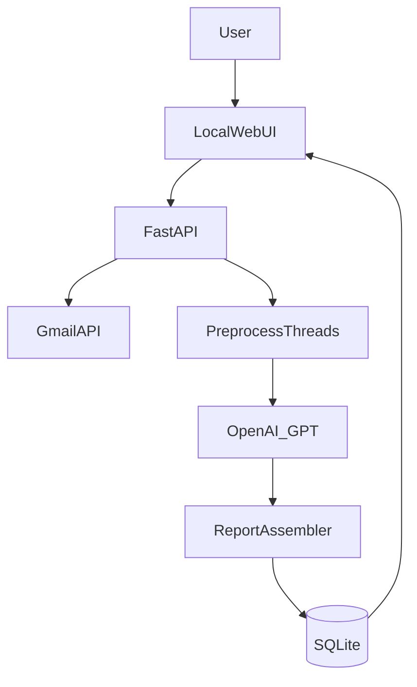

# Email Agent — 本地邮件日报

本地应用：拉取 Gmail 邮件，用 GPT 生成每日邮件报告，在本地 Web 界面查看，减少手动翻邮箱。

---

## 目标与场景

- **目标**：每天自动或手动拉取 Gmail 邮件，识别重要内容，用 GPT 生成「每日邮件报告」，在本地 Web UI 查看，快速了解需要关注和行动的邮件。
- **非目标（第一版）**：回复/发信自动化、多邮箱/多团队权限、移动端。

---

## MVP 功能范围（第一版）

- **Gmail OAuth 登录**：本地回调，仅申请 `read-only` 权限拉取邮件。
- **邮件拉取策略**：
  - 默认：近 24 小时（或指定日期）。
  - 可选过滤：未读、带星标、特定发件人、关键词。
- **邮件预处理**：去重、按线程合并、提取纯文本（保留主题/发件人/时间/片段）。
- **GPT 总结**：
  - 分类：需要我行动 / 重要通知 / 账单订阅 / 社交 / 其它。
  - 每封或每线程：一句话摘要 + 是否需要行动 + 建议下一步。
  - 整体日报：今日重点 3–7 条 + 待办列表。
- **报告存储**：本地 SQLite，支持历史查询。
- **Web UI**：
  - 查看某天的报告。
  - 点击展开被引用邮件的元数据（第一版可只给 snippet / 链接到 Gmail）。
  - 导出：Markdown 或 HTML（至少一种）。
- **安全**：OpenAI Key 放 `.env`；OAuth token 存本地文件或数据库。

---

## 技术栈

| 用途 | 技术 |
|------|------|
| 后端 | FastAPI |
| Gmail | Google APIs（OAuth 2.0），`google-auth`, `google-auth-oauthlib`, `google-api-python-client` |
| AI | OpenAI API（GPT），`openai` |
| 存储 | SQLite + SQLAlchemy（或 `sqlite3` 直连） |
| 任务调度 | MVP：手动触发 + Windows 任务计划程序；后续可加 APScheduler |
| 前端 | MVP：FastAPI + Jinja2 模板；后续可升级为 React/Vite 单页 |

---

## 架构与数据流



### 模块边界

- **FastAPI**：路由、认证中间件、请求/响应模型。
- **Gmail 集成**：OAuth 流、拉取 message/thread、解析 headers/snippet。
- **Preprocess**：去重、按 thread 合并、抽取纯文本、统一数据结构。
- **OpenAI**：构造 prompt、调用 GPT、解析结构化输出（JSON schema）。
- **ReportAssembler**：将 GPT 输出与邮件引用组装成日报实体。
- **SQLite**：报告与邮件引用持久化；不落全量正文（可配置）。
- **Web UI**：仅消费 API 与模板，不直接访问 Gmail/OpenAI。

---

## 目录结构（建议）

```
app/
  main.py              # 入口与路由挂载
  web/                 # Jinja2 模板与静态资源
  integrations/
    gmail/             # OAuth、拉取、解析
    openai/            # prompt、调用、重试
  core/                # 配置、日志、时间范围、去重
  db/                  # 模型、迁移（可选）、DAO
  services/            # 报告生成管线
scripts/               # 命令行脚本（生成某日报告、回填历史等）
data/                  # 本地数据（token、db、导出文件）
```

---

## Skills（应用内能力模块）

> 每个 Skill 为可独立测试的模块，有明确输入/输出与错误处理。

### SkillGmailAuth

- **职责**：启动 OAuth 流、刷新 token、权限检查。
- **输入**：无（首次）/ 已存 refresh token。
- **输出**：有效 `Credentials` 或重定向 URL；失败时抛出 `AuthError`。
- **错误处理**：token 过期自动刷新；刷新失败返回明确错误码，引导用户重新授权。
- **可测试性**：用 mock `google.oauth2.credentials` 与假 redirect，单元测试授权状态与刷新逻辑。

### SkillGmailFetch

- **职责**：按时间范围与过滤条件拉取 message/thread 元数据与 snippet。
- **输入**：`date_from`, `date_to`（或「近 24h」）、可选 `filters`（未读/星标/发件人/关键词）。
- **输出**：`List[MessageSummary]`（id, thread_id, subject, from, date, snippet, labels）。
- **错误处理**：API 限流时退避重试；网络错误区分可重试/不可重试，记录日志。
- **可测试性**：用 Gmail API mock 或本地 JSON fixture 测试查询与解析。

### SkillEmailNormalize

- **职责**：解析 MIME/HTML→纯文本、统一字段结构；可选语言检测。
- **输入**：原始 message 或已取 body/snippet。
- **输出**：`NormalizedEmail`（subject, from, to, date_utc, body_plain, snippet, lang）。
- **错误处理**：解析失败时保留 snippet 作为 fallback；记录解析错误不中断管线。
- **可测试性**：用固定 eml/html 样本测试编码、HTML 标签剥离、字段映射。

### SkillThreadMerge

- **职责**：按 thread_id 聚合、去重、抽取「上下文窗口」供 GPT 使用。
- **输入**：`List[NormalizedEmail]`。
- **输出**：`List[ThreadContext]`（thread_id, subject, messages_ordered, combined_text 或摘要长度限制）。
- **错误处理**：单 thread 过大时截断并标记，避免超 token 限制。
- **可测试性**：给定多封同 thread 邮件，断言顺序与去重结果。

### SkillImportanceHeuristics

- **职责**：规则打分（未读、星标、特定域名、关键词），用于排序或过滤。
- **输入**：`NormalizedEmail` 或 `MessageSummary`；可选规则配置。
- **输出**：`importance_score` 或 `priority_label`。
- **错误处理**：规则配置错误时回退到默认权重，记录警告。
- **可测试性**：用已知标签/发件人邮件断言分数与排序。

### SkillPromptCompose

- **职责**：根据邮件集合生成稳定的 system/user prompt。
- **输入**：`List[ThreadContext]` 或归一化后的邮件列表；可选分类/格式偏好。
- **输出**：`system_prompt`, `user_prompt`（字符串或消息列表）。
- **错误处理**：输入为空时返回「今日无邮件」占位 prompt，不调用 GPT。
- **可测试性**：固定输入断言 prompt 包含关键指令与邮件片段，且长度在限制内。

### SkillGptSummarize

- **职责**：调用 OpenAI API，带重试/限流/超时；返回结构化输出（JSON schema）。
- **输入**：`system_prompt`, `user_prompt`；可选 `response_format`（JSON schema）。
- **输出**：解析后的日报结构（分类列表、待办、今日重点等）。
- **错误处理**：429/5xx 重试；超时与无效 JSON 记录并返回明确错误类型；不在日志中打印 key/token。
- **可测试性**：mock `openai.ChatCompletion.create`，断言请求参数与解析结果。

### SkillReportStore

- **职责**：保存报告、关联邮件引用、按日期查询历史。
- **输入**：`Report` 实体 + `List[EmailReference]`。
- **输出**：`report_id`；查询接口返回 `Report` 或列表。
- **错误处理**：DB 不可用时返回友好错误；写入冲突时幂等或版本号处理。
- **可测试性**：内存 SQLite 或 fixture DB，测试 CRUD 与按日期查询。

### SkillExport

- **职责**：将报告导出为 Markdown 或 HTML。
- **输入**：`Report` 或 `report_id`；格式 `md`/`html`。
- **输出**：文件路径或字节流。
- **错误处理**：报告不存在返回 404；模板缺失时记录并返回通用错误。
- **可测试性**：固定报告内容断言导出片段与格式。

### SkillScheduler

- **职责**：在固定时间触发「生成当日报告」；MVP 先提供 Windows 任务计划示例。
- **输入**：时间配置（如每天 08:00）；可选环境/工作目录。
- **输出**：无（侧效应：生成并存储报告）。
- **错误处理**：脚本内捕获异常、写日志、退出码非 0 便于任务计划告警。
- **可测试性**：可单独测试「生成报告」入口函数；调度本身依赖系统配置文档说明。

---

## 配置

### 环境变量（`.env`）

| 变量 | 说明 |
|------|------|
| `OPENAI_API_KEY` | OpenAI API 密钥（必填） |
| `OPENAI_MODEL` | 模型名，默认 `gpt-4o-mini` |
| `APP_BASE_URL` | 本地回调基地址，如 `http://127.0.0.1:8000` |

### Google OAuth

- 在 [Google Cloud Console](https://console.cloud.google.com/) 创建 OAuth 2.0 客户端（桌面或 Web 应用）。
- 将下载的 `credentials.json` 放到项目根目录或 `data/`（README 与代码中统一约定路径）。
- 授权重定向 URI 配置为：`http://127.0.0.1:<port>/auth/google/callback`（与 FastAPI 实际端口一致）。

---

## 运行指南

1. **安装依赖**
   ```bash
   python -m venv .venv
   .venv\Scripts\activate
   pip install -r requirements.txt
   ```

2. **放置 `credentials.json`**  
   将 Gmail OAuth 客户端凭据放到项目根目录或 `data/`。

3. **设置 `.env`**  
   复制 `.env.example` 为 `.env`，填写 `OPENAI_API_KEY`、`OPENAI_MODEL`（可选）、`APP_BASE_URL`（可选）。

4. **启动 FastAPI**
   ```bash
   uvicorn app.main:app --reload --host 127.0.0.1 --port 8000
   ```

5. **浏览器打开**  
   访问 `http://127.0.0.1:8000`，按页面提示完成 Gmail 授权，然后可手动触发「生成今日报告」并查看/导出。

6. **（可选）定时报告**  
   使用 Windows 任务计划程序，在指定时间执行：
   ```bash
   .venv\Scripts\python.exe scripts\generate_daily_report.py
   ```
   具体命令与工作目录以项目内 `scripts/` 实现为准。

---

## 质量与隐私

- 默认只保存报告与邮件元数据/摘要，不落全量正文；是否存正文可由配置开关控制。
- 后续可增加：调用 OpenAI 前的敏感信息清洗/脱敏。
- 日志中禁止打印 API key、OAuth token 等敏感信息。

---

## 常见问题

- **授权失败或 token 失效**：删除本地 token 文件后重新在 Web 页完成 OAuth；确认 `credentials.json` 与重定向 URI 与当前运行端口一致。
- **OpenAI 超时或限流**：检查网络与 API 配额；应用内已做重试与退避，可适当调大超时时间。
- **报告为空**：确认拉取时间范围与过滤条件；检查 Gmail API 权限是否为只读且包含 `gmail.readonly`。
- **无法导出**：确认报告已成功生成并写入 SQLite；查看服务端日志是否有模板或文件路径错误。

---

## 后续路线图

- 多邮箱支持（多组 OAuth 凭据或账号切换）。
- 自定义规则：重要性规则、发件人白名单/黑名单、关键词过滤。
- RAG：对历史邮件/报告做检索与问答。
- 通知渠道：桌面通知、Slack、Telegram 等（可选）。
