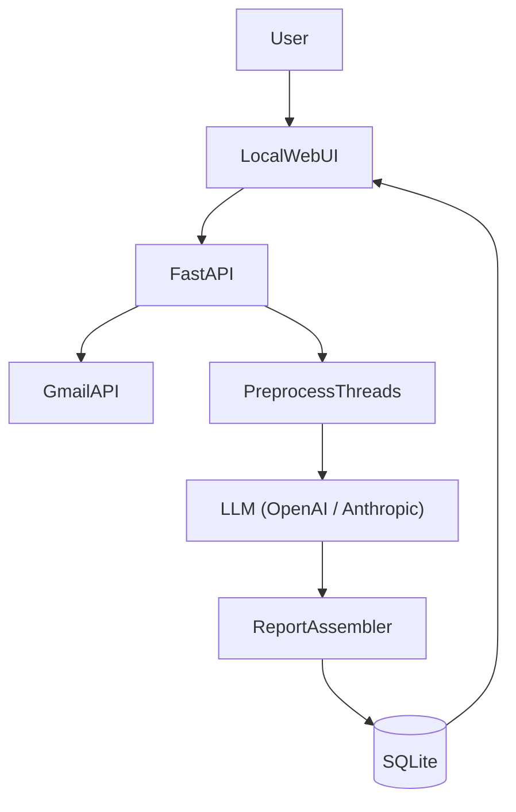

# Email Agent — 本地邮件日报

[English](README.md) | [简体中文](README.zh-CN.md)

本地应用：拉取 Gmail 邮件，用 AI（OpenAI / Claude）生成每日邮件报告，在本地 Web 界面查看，减少手动翻邮箱。

---

## 目标与场景

- **目标**：每天自动或手动拉取 Gmail 邮件，识别重要内容，用 AI 生成「每日邮件报告」，在本地 Web UI 查看，快速了解需要关注和行动的邮件。
- **非目标（第一版）**：回复/发信自动化、多邮箱/多团队权限、移动端。

---

## MVP 功能范围（第一版）

- **Gmail OAuth 登录**：本地回调，仅申请 `read-only` 权限拉取邮件。
- **邮件拉取策略**：
  - 默认：近 24 小时（或指定日期）。
  - 可选过滤：未读、带星标、特定发件人、关键词。
- **邮件预处理**：去重、按线程合并、提取纯文本（保留主题/发件人/时间/片段）。
- **AI 总结**：
  - 分类：需要我行动 / 重要通知 / 账单订阅 / 社交 / 其它。
  - 每封或每线程：一句话摘要 + 是否需要行动 + 建议下一步。
  - 整体日报：今日重点 3–7 条 + 待办列表。
- **报告存储**：本地 SQLite，支持历史查询。
- **Web UI**：
  - 查看某天的报告。
  - 点击展开被引用邮件的元数据（第一版可只给 snippet / 链接到 Gmail）。
  - 导出：Markdown 或 HTML（至少一种）。
- **安全**：API Key 放 `.env`；OAuth token 存本地文件或数据库（并已 gitignored）。

---

## 技术栈

| 用途 | 技术 |
|------|------|
| 后端 | FastAPI |
| Gmail | Google APIs（OAuth 2.0），`google-auth`, `google-auth-oauthlib`, `google-api-python-client` |
| AI | OpenAI（`openai`）与/或 Anthropic（`anthropic`） |
| 存储 | SQLite + SQLAlchemy |
| 任务调度 | MVP：手动触发 + Windows 任务计划程序；后续可加 APScheduler |
| 前端 | MVP：FastAPI + Jinja2 模板；后续可升级为 React/Vite 单页 |

---

## 架构与数据流



### 模块边界

- **FastAPI**：路由、认证中间件、请求/响应模型。
- **Gmail 集成**：OAuth 流、拉取 message/thread、解析 headers/snippet。
- **Preprocess**：去重、按 thread 合并、抽取纯文本、统一数据结构。
- **LLM 集成**：构造 prompt、调用模型、解析结构化输出。
- **SQLite**：报告与邮件引用持久化；默认不落全量正文（可配置）。
- **Web UI**：仅消费 API 与模板，不直接访问 Gmail/LLM。

---

## 目录结构（建议）

```
app/
  main.py              # 入口与路由挂载
  web/                 # Jinja2 模板与静态资源
  integrations/
    gmail/             # OAuth、拉取、解析
    openai/            # prompt、调用、重试
    anthropic/         # prompt、调用、重试
  core/                # 配置、日志、时间范围、去重
  db/                  # 模型与持久化
  services/            # 报告生成管线
scripts/               # CLI 脚本（生成报告、测试等）
data/                  # 本地数据（token、db、导出文件）- gitignored
```

---

## 配置

### 环境变量（`.env`）

复制 `.env.example` 为 `.env`，然后填写：

- `AI_PROVIDER`：`openai` 或 `claude`
- `OPENAI_API_KEY` / `OPENAI_MODEL`
- `ANTHROPIC_API_KEY` / `ANTHROPIC_MODEL`
- `APP_BASE_URL`（默认 `http://127.0.0.1:8000`）

### Google OAuth（`credentials.json`）

1. 在 [Google Cloud Console](https://console.cloud.google.com/) 创建 OAuth 2.0 客户端（桌面或 Web 应用）
2. 下载 `credentials.json` 并放到项目根目录
3. 配置重定向 URI：`http://127.0.0.1:8000/auth/google/callback`

提示：仓库内提供 `credentials.json.example` 模板，**不要提交真实凭据**。

---

## 运行指南

1. **安装依赖**

```bash
python -m venv .venv
.venv\Scripts\activate
pip install -r requirements.txt
```

2. **启动 FastAPI**

```bash
uvicorn app.main:app --reload --host 127.0.0.1 --port 8000
```

3. **浏览器完成 Gmail 授权**

访问 `http://127.0.0.1:8000`，按页面提示完成 OAuth。

4. **（可选）用 CLI 生成报告**

```bash
python scripts/generate_report.py
python scripts/generate_report.py --hours 24
python scripts/generate_report.py --date 2026-01-30
```

---

## 质量与隐私

- API Key 放 `.env`（已 gitignored）。
- OAuth token 与导出文件在 `data/`（已 gitignored）。
- 默认只保存报告与邮件元数据/摘要，不落全量正文（可配置）。
- 日志中禁止打印 API key、OAuth token 等敏感信息。

---

## 常见问题

- **授权失败或 token 失效**：删除 `data/token.json` 后重新授权；确认 `credentials.json` 与重定向 URI 与当前运行端口一致。
- **限流或超时**：检查网络与配额；必要时调大重试/超时。
- **报告为空**：确认拉取时间范围与过滤条件；检查权限是否包含 `gmail.readonly`。

---

## 后续路线图

- 多邮箱支持（多组 OAuth 凭据或账号切换）
- 自定义规则：重要性规则、发件人白名单/黑名单、关键词过滤
- RAG：对历史邮件/报告做检索与问答
- 通知渠道：桌面通知、Slack、Telegram 等（可选）

