# 逐步实现规划

按依赖顺序拆分的实现步骤，每步产出可验证；上一步完成后再做下一步。

---

## 依赖关系概览

```mermaid
flowchart LR
  subgraph phase1 [阶段一 基础]
    S1[Step1_Scaffold]
    S2[Step2_Config]
    S3[Step3_Storage]
  end
  subgraph phase2 [阶段二 Gmail]
    S4[Step4_GmailAuth]
    S5[Step5_GmailFetch]
  end
  subgraph phase3 [阶段三 预处理]
    S6[Step6_Normalize]
    S7[Step7_ThreadMerge]
    S8[Step8_Importance]
  end
  subgraph phase4 [阶段四 AI与管线]
    S9[Step9_OpenAI]
    S10[Step10_ReportPipeline]
  end
  subgraph phase5 [阶段五 API与UI]
    S11[Step11_FastAPI]
    S12[Step12_WebUI]
    S13[Step13_Export]
  end
  subgraph phase6 [阶段六 脚本与收尾]
    S14[Step14_Scripts]
    S15[Step15_Polish]
  end
  S1 --> S2 --> S3
  S3 --> S4 --> S5 --> S6 --> S7 --> S8 --> S9 --> S10
  S10 --> S11 --> S12 --> S13 --> S14 --> S15
```

---

## 阶段一：基础

### Step 1 — 项目脚手架

**目标**：可运行的 Python 项目与目录结构。

**实现**：

- 创建 `app/` 及子目录：`web/`, `integrations/gmail/`, `integrations/openai/`, `core/`, `db/`, `services/`；创建 `scripts/`, `data/`。
- 添加 `app/__init__.py` 等包文件；`app/main.py` 仅挂载一个健康检查路由（如 `GET /health` 返回 `{"ok": true}`）。
- 添加 `requirements.txt`：`fastapi`, `uvicorn`, `python-dotenv`（其余依赖在后续步骤按需加入）。
- 根目录 `.gitignore`：`.env`, `data/*.json`, `data/*.db`, `__pycache__`, `.venv`。

**验收**：`pip install -r requirements.txt` 后 `uvicorn app.main:app --reload`，访问 `/health` 返回 200。

---

### Step 2 — 配置与日志（core）

**目标**：统一读取环境变量与日志，为后续模块提供配置入口。

**实现**：

- `app/core/config.py`：从环境变量读取 `OPENAI_API_KEY`, `OPENAI_MODEL`（默认 `gpt-4o-mini`）, `APP_BASE_URL`；Gmail `credentials.json` 路径（如项目根或 `data/`）；敏感字段不打印。
- `app/core/logging.py`：配置 logging（格式、级别）；封装「不打印 key/token」的日志工具（若需记录 URL 则脱敏）。

**验收**：在无 `.env` 时部分配置为空或默认值；设置 `.env` 后能正确读取；日志中无明文 key。

---

### Step 3 — 存储层（SkillReportStore 雏形）

**目标**：报告与邮件引用的持久化，供管线和 Web 使用。

**实现**：

- `app/db/models.py`：定义 SQLAlchemy 模型（或等价 schema）：`Report`（id, date, summary_json, created_at）、`EmailReference`（id, report_id, message_id, thread_id, subject, from_addr, snippet, gmail_url 等）。
- `app/db/session.py`：SQLite 引擎与 session 工厂；DB 文件路径可配置（如 `data/reports.db`）。
- `app/db/report_store.py`：SkillReportStore — `save_report(report, email_refs) -> report_id`；`get_report_by_id(id)`；`list_reports(date_from?, date_to?)`；必要时 `get_report_by_date(date)`。

**验收**：单元测试用内存 SQLite，调用 save 后 list/get 能正确读写；表结构支持后续「按日期查报告」。

---

## 阶段二：Gmail 集成

### Step 4 — Gmail OAuth（SkillGmailAuth）

**目标**：在浏览器完成授权，本地保存 token，后续请求可带有效 Credentials。

**实现**：

- `app/integrations/gmail/auth.py`：根据 `credentials.json` 构建 OAuth 2.0 流；`get_authorization_url() -> url`；`exchange_code_for_token(code)` 并持久化 token 到 `data/token.json`（或 DB）；`load_credentials() -> Credentials | None`，过期时刷新并保存。
- 定义 `AuthError`，在 token 缺失/刷新失败时抛出，并包含「需重新授权」的提示信息。

**验收**：单元测试用 mock credentials 与假 redirect，能覆盖「无 token → 需授权」「有 token → 返回 Credentials」「过期 token → 刷新」；手动跑一次能生成 `data/token.json` 并可用。

---

### Step 5 — Gmail 拉取（SkillGmailFetch）

**目标**：按时间范围与简单过滤拉取邮件元数据与 snippet。

**实现**：

- `app/integrations/gmail/fetch.py`：使用 Gmail API `users().messages().list` + `get`；输入 `date_from`, `date_to`（或「近 24h」），可选 `unread_only`, `starred_only`；输出 `List[MessageSummary]`（id, thread_id, subject, from, date, snippet, labels）。
- 对 429/5xx 做有限次重试与退避；网络错误区分可重试/不可重试并打日志。

**验收**：在已授权前提下，指定「近 24h」能返回若干条 MessageSummary；单元测试用 API mock 或 fixture 验证解析与重试逻辑。

---

## 阶段三：预处理

### Step 6 — 邮件归一化（SkillEmailNormalize）

**目标**：将 Gmail message 或已有 body/snippet 转为统一结构，便于后续合并与送 GPT。

**实现**：

- `app/core/schemas.py`（或 `app/integrations/gmail/normalize.py`）：定义 `MessageSummary`（与 Fetch 输出一致）、`NormalizedEmail`（subject, from, to, date_utc, body_plain, snippet, lang?）。
- `app/integrations/gmail/normalize.py`：SkillEmailNormalize — 输入 message 或 snippet；若需 body 则调用 Gmail API 取 part，MIME/HTML 转纯文本；输出 `NormalizedEmail`；解析失败时用 snippet 作为 body_plain fallback。

**验收**：用固定 eml/html 或 Gmail API 返回的 fixture 测试，输出字段完整且无裸 HTML；异常输入不抛未捕获异常。

---

### Step 7 — 按线程合并（SkillThreadMerge）

**目标**：按 thread_id 聚合、去重、生成供 GPT 使用的上下文。

**实现**：

- `app/services/thread_merge.py`：输入 `List[NormalizedEmail]`；按 thread_id 分组，组内按时间排序；输出 `List[ThreadContext]`（thread_id, subject, messages_ordered, combined_text，并设最大长度或条数限制，超则截断并标记）。

**验收**：给定多封同 thread 邮件，输出一条 ThreadContext，combined_text 包含各条内容且顺序正确；单 thread 过大时截断且可识别。

---

### Step 8 — 重要性规则（SkillImportanceHeuristics）

**目标**：对邮件/线程打分或打标签，用于排序或过滤。

**实现**：

- `app/services/importance.py`：输入 `NormalizedEmail` 或 `MessageSummary`；规则：未读 +分、星标 +分、特定域名/关键词（可配置）；输出 `importance_score` 或 `priority_label`；配置错误时回退默认权重并打日志。

**验收**：单元测试用已知标签/发件人断言分数或排序结果；无配置时使用默认规则不报错。

---

## 阶段四：AI 与报告管线

### Step 9 — OpenAI 总结（SkillPromptCompose + SkillGptSummarize）

**目标**：根据邮件上下文生成 system/user prompt，调用 GPT 并解析结构化日报。

**实现**：

- `app/integrations/openai/prompts.py`：SkillPromptCompose — 输入 `List[ThreadContext]`；输出 `system_prompt`, `user_prompt`；空输入时返回「今日无邮件」占位，不调用 API。
- `app/integrations/openai/summarize.py`：SkillGptSummarize — 输入 prompt；调用 `openai.ChatCompletion.create`，使用 JSON schema 约束输出；重试 429/5xx、超时与无效 JSON 处理；返回解析后的日报结构（分类列表、待办、今日重点等）。
- 配置从 `app/core/config` 读取；日志中不打印 key。

**验收**：mock `openai` 客户端，固定 prompt 得到预期 JSON 结构；空邮件列表不发起请求；重试与错误类型可测。

---

### Step 10 — 报告生成管线（ReportAssembler + 与 Store 串联）

**目标**：从「拉取 → 预处理 → GPT → 存库」一条龙，供 API 与脚本调用。

**实现**：

- `app/services/report_pipeline.py`：入口函数如 `generate_report_for_date(date, credentials)`：调用 GmailFetch（date 对应时间范围）→ Normalize → ThreadMerge → Importance（排序/过滤）→ PromptCompose → GptSummarize → 组装 Report 与 EmailReference → ReportStore.save_report。
- 管线内异常分类：可重试（如网络）与不可重试（如权限），向上抛出或返回 Result 类型。

**验收**：在已授权 + 有 OpenAI key 的前提下，对「今天」或「昨天」跑一次管线能生成一条报告并写入 SQLite；无邮件时生成「今日无邮件」类报告并同样入库。

---

## 阶段五：API 与 Web UI

### Step 11 — FastAPI 路由与 Gmail 回调

**目标**：提供 Web 入口、OAuth 回调、报告触发与查询接口。

**实现**：

- `app/main.py`：挂载路由；加载配置与日志。
- `app/web/routes/auth.py`：`GET /auth/google` 重定向到 Gmail 授权 URL；`GET /auth/google/callback?code=...` 用 code 换 token 并保存，重定向到首页或「已授权」页。
- `app/web/routes/reports.py`：`POST /api/reports/generate`（可选 query `date=`）触发 report_pipeline，返回 `report_id` 或错误；`GET /api/reports` 支持 `date_from`, `date_to` 查询；`GET /api/reports/{id}` 返回单条报告（含邮件引用）。
- 依赖注入：从 session 或 token 文件取 Credentials；未授权时 401 或重定向到 `/auth/google`。

**验收**：浏览器访问 `/auth/google` 完成授权后，`POST /api/reports/generate` 能生成报告；`GET /api/reports` 与 `GET /api/reports/{id}` 返回正确数据。

---

### Step 12 — Web UI 页面（Jinja2）

**目标**：本地可用的报告列表与报告详情页。

**实现**：

- `app/main.py` 配置 Jinja2Templates，静态文件目录指向 `app/web/static`。
- `app/web/templates/base.html`：公共布局（标题、导航）。
- `app/web/templates/index.html`：首页 — 显示「连接 Gmail」或「生成今日报告」按钮；报告列表（日期、摘要预览、链接到详情）。
- `app/web/templates/report_detail.html`：单日报告 — 今日重点、待办、分类列表；每条引用可展开显示 snippet/元数据及「在 Gmail 中打开」链接。
- 路由：`GET /` 渲染首页（并拉取报告列表）；`GET /reports/{id}` 渲染报告详情。

**验收**：本地访问 `/` 能看到列表；点击某报告进入详情，展开邮件引用可见 snippet 与 Gmail 链接。

---

### Step 13 — 导出（SkillExport）

**目标**：报告导出为 Markdown 或 HTML。

**实现**：

- `app/services/export.py`：SkillExport — 输入 `Report` 或 `report_id`（从 Store 查），格式 `md`/`html`；输出文件路径或字节流；报告不存在返回明确错误。
- `app/web/routes/reports.py`：`GET /api/reports/{id}/export?format=md|html` 返回文件下载或流；或 `GET /reports/{id}/export?format=md` 触发下载。
- HTML 导出可用 Jinja2 模板复用报告详情结构。

**验收**：对已有 report_id 请求 export md/html 得到正确内容；不存在的 id 返回 404。

---

## 阶段六：脚本与收尾

### Step 14 — 命令行脚本与定时示例

**目标**：支持不启动 Web 也能生成报告；提供 Windows 定时任务示例。

**实现**：

- `scripts/generate_daily_report.py`：读取本地已存 token（或通过环境变量指定）；调用 report_pipeline 生成「今天」的报告；异常时打日志并 `sys.exit(1)`。
- `docs/scheduled_task_windows.md`（或 README 小节）：Windows 任务计划程序配置步骤 — 程序为 `.venv\Scripts\python.exe`，参数为 `scripts/generate_daily_report.py`，工作目录为项目根，触发器为每日指定时间。

**验收**：在已授权且 key 配置好的情况下，命令行执行脚本能生成当日报告；文档中步骤可复现。

---

### Step 15 — 收尾与文档

**目标**：交付可被他人复用的最小可运行版本。

**实现**：

- 根目录 `.env.example`：列出 `OPENAI_API_KEY`, `OPENAI_MODEL`, `APP_BASE_URL` 及简要说明，无真实值。
- `README.md` 中「运行指南」与「常见问题」与当前实现一致（依赖安装、credentials 位置、端口、导出与定时任务命令）。
- 确认 `data/` 与 token/db 路径在 `.gitignore` 中，避免误提交。

**验收**：新 clone 项目按 README 可完成「安装 → 配置 → 授权 → 生成报告 → 查看与导出」；常见问题条目与当前行为一致。

---

## 步骤与 Skills 对照

| 步骤 | 主要对应 Skill / 模块 |
|------|------------------------|
| 1 | 项目结构 |
| 2 | core/config, core/logging |
| 3 | SkillReportStore（db） |
| 4 | SkillGmailAuth |
| 5 | SkillGmailFetch |
| 6 | SkillEmailNormalize |
| 7 | SkillThreadMerge |
| 8 | SkillImportanceHeuristics |
| 9 | SkillPromptCompose, SkillGptSummarize |
| 10 | ReportAssembler（管线） |
| 11 | FastAPI 路由、OAuth 回调 |
| 12 | Web UI（Jinja2） |
| 13 | SkillExport |
| 14 | SkillScheduler（脚本 + 文档） |
| 15 | .env.example, README/FAQ 同步 |

按此顺序实现，每步验收通过后再进行下一步，可最大程度减少返工。
